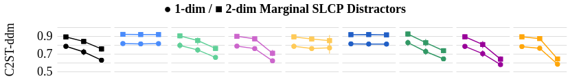
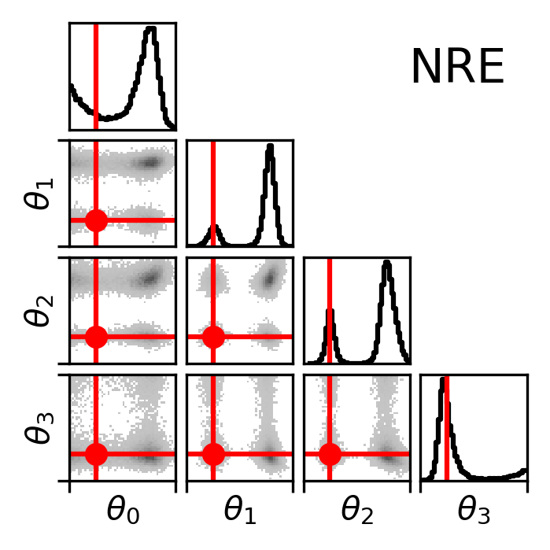
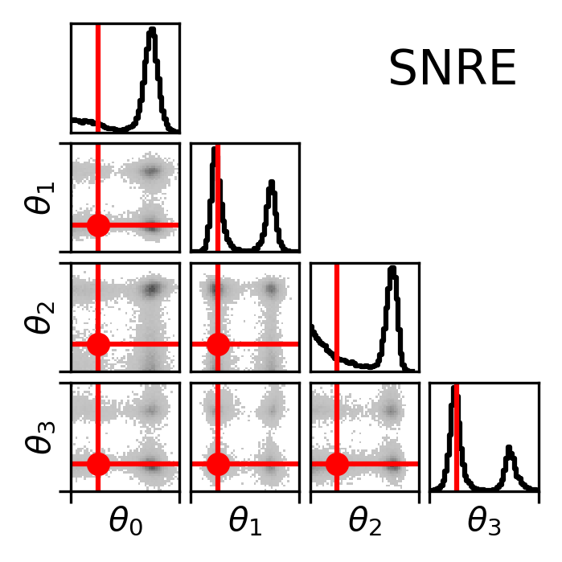
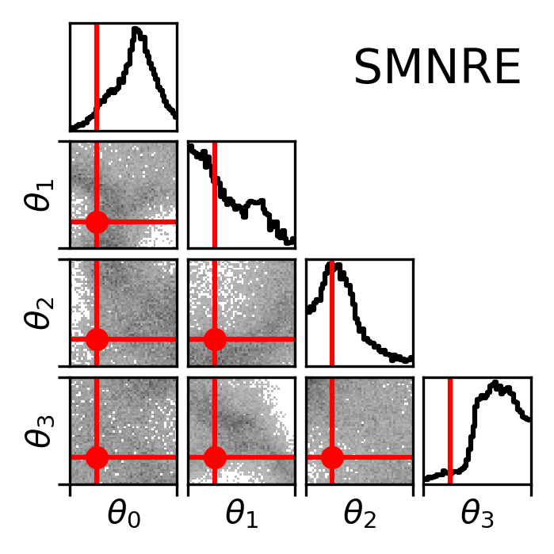

# Truncated Marginal Neural Ratio Estimation

This repository is the official implementation of the experiments from [Truncated Marginal Neural Ratio Estimation]() (**deanonymize**.  link to the arxiv will be put here)
The underlying library is called swyft and we perform experiments with sbi and sbibm.


## Requirements

To install the requirements using conda, run the following command. Note, it assumes that you can install `cudatoolkit=11.1`. If not, change the `environment.yml` file accordingly. (See pytorch's website.)

```setup
conda env create --prefix .tmnre_env --file environment.yml
conda activate ./.tmnre_env
```

## sbibm results

### Marginalizing sbibm

Performing the marginalization of sbibm requires the [very large raw dataset from sbibm](https://github.com/mackelab/benchmarking_sbi_runs).
If you would like to install it so you can perform the marginalization, we recommend first installing [Git LFS](https://git-lfs.github.com/) then executing the following commands.

```setup
cd remote
git submodule add git@github.com:mackelab/benchmarking_sbi_runs.git
```

We use [hydra](https://hydra.cc/) to perform the marginalization and calculation of the c2st-ddm performance metric on the existing sbibm posterior data. Assuming you installed the raw sbibm dataset (see above), you can run the following command to calculate the c2st for every 1-dim and 2-dim marginal from the slcp task estimated by the nre algorithm with the following command:

```bash
python marginalize_sbibm/calc_marginalized_c2st.py raw_results_root=remote/benchmarking_sbi_runs/runs/ algorithm=nre task=slcp
```

If you were interested in several algorithms...

```bash
python marginalize_sbibm/calc_marginalized_c2st.py raw_results_root=remote/benchmarking_sbi_runs/runs/ algorithm=nre,npe,snre,snpe task=slcp -m
```

Note that the `-m` flag is required for hydra's multirun. Calculating the c2st for every marginal, observation, algorithm, and task is expensive. It requires training over 100,000 classifiers. We would recommend consulting hydra's documentation to easily use slurm or another scheduler to accomplish the task with multirun.

Both of the above commands produce output according to hydra's default behavior.

Finally, once you've calculated the metrics of interest, we can summarize the results with another command:

```bash
python marginalize_sbibm/summarize_marginalized_c2st.py ~/path/to/marginals marginal-sbibm-results.csv
```

We have provided a results file already calculated in `marginalize_sbibm/marginal-c2st-summary.csv`. It was computed using the raw data from our marginalization runs. The raw data is available in [another repository with git lfs]() (**deanonymize** the raw (~2gb) data was simply too large to host and send anonymously. The summarized data is obviously available.).

### tmnre on sbibm

Training and evaluating `tmnre` on a selection of sbibm tasks can be done using three programs in the `inference_sbibm` folder, namely `run.py`,`summarize.py`, and `metrics.py`. For training, preparation for plotting, and evaluation respectively. `run.py` implicitly calls `metrics.py` if you setup the hydra configuration correctly. There are many configuration options, we encourage the user to explore them by running `python inference_sbibm/run.py -h`. The following is a simple example run which trains, then generates the performance metric information for every 1-dim and 2-dim marginal.

```bash
python inference_sbibm/run.py task=two_moons task.num_simulations=10_000 task.num_observation=2 hardware=cuda0 analysis=metrics_2d_marginals 
```

Once you have done enough training and evaluation that you'd like to make a summary dataframe and a plot. First summarize the data using the following command.

```bash
python inference_sbibm/summarize.py ~path/to/data tmnre-sbibm-results.csv
```

We have provided a file already computed in `inference_sbibm/reports/swyft_uniform_2d_results_budget.csv`. It was computed using the raw data from our experimental runs. The raw data is available in [another repository with git lfs]() (**deanonymize** the raw (~15gb) data was simply too large to send anonomously. The summary data is available.)

### Generating the comparison plot

The jupyter notebook `compare.ipynb` is designed to use the plotting functions built into sbibm to create the plot that we reported in our paper. It requires two summary dataframes. They have already been provided for you and will be referenced if you simply run all the cells of the notebook.

## Torus

### Ground Truth

The ground truth for this task was generated using rejection sampling. The task itself is defined within the `sbibm` framework. The ten observations and corresponding ground truth posterior sample data is presented, along with the code to generate it, in `remote/sbibm/torus`. All observations are generated with the same underlying parameter but different noise realizations. The first observation is generated without noise.

### Epsilon Hyperparameter Sweep

The torus task is defined within our custom version of sbibm, a submodule in this package. Therefore, we can train on that task simply by calling a script which applies `tmnre` to the problem. We also applied hydra to this experiment. You can specify the hardware to train on using options `cpu` and `cuda0`. Epsilon is input as the exponent of a power of 10. The default `-6` implies `epsilon=10 ** -6`.

```bash
python torus/epsilon/torus.py hardware=cuda0 epsilon=-6
```

Once you have run the experiment multiple times, we create a summary dataframe like so:

```bash
python torus/epsilon/summarize.py ~/path/to/torus_sweep epsilon-results.csv
```

### Comparing tmnre to mnre

The training of these methods is implemented in a jupyter notebook `gen-torus.ipynb` with diagnostic plots. When the `SAVE` flag is turned on, the notebook trains and generates a number of data pickles.

## Eggbox

### Ground Truth

The ground truth for this task was generated using `D` 1-dimensional independent draws from a numerical inverse transform sampling method. The task itself is defined within the `sbibm` framework. we only present a single observation as reported in the paper. The code to generate ground truth data of any dimensionality can be found in `remote/sbibm/eggbox` along with 3, 5, 10, 25 dimensional ground truth posterior samples.

### Comparing mnre to nre, snre, smnre

Training `mnre`, `nre`, and `snre` are all implemented within a jupyter notebook, along with diagnostic plots, in `eggbox/gen-eggbox.ipynb`. If the `SAVE` flag is turned on, the notebook trains and generates data pickles which contain c2st results, reference posterior samples, and estimated posterior samples. Finally, `msnre` is trained in another notebook `eggbox/smnre-eggbox-few.ipynb` where it produces posterior samples in another pickle. Finally, the reported plots are created in the `eggbox/plot-eggbox.ipynb` notebook.


## Physics example

The cosmology simulator uses the code [CLASS](https://github.com/lesgourg/class_public/), but we have saved the datastore so the simulator doesn't need to be called. It is is shipped with [this repository]() which can be installed using git lfs. (**deanonymize** the data was simply too large to send anonomously (~3 GB). Processed data in the form of plots and notebooks are available within the `physics` folder.)  Simply set the `LOAD` flag to `True` and the notebook `CMB_TTTEEE.ipynb` should run. The observation `obs` is also shipped with the repository -- this is needed to define the stochastic part of the simulator. The plots are made using [getdist](https://github.com/cmbant/getdist).

# Results

## sbibm





## Torus

A few posteriors from the torus problem. Ground truth, tmnre, and mnre.  


A comparison of mnre to tmnre with several metrics.  


Results of our hyperparameter scan.  


## Eggbox

A few posteriors from the eggbox problem. Ground truth, mnre, nre, and smnre.  







## Stochasticity

The simulation and training is done in parallel. That means that even with a fixed seed, it is usually impossible to return exactly the same results. Data is therefore provided to reproduce our plots.

## Contributing

(**deanonymize** this will be added to the public code)
